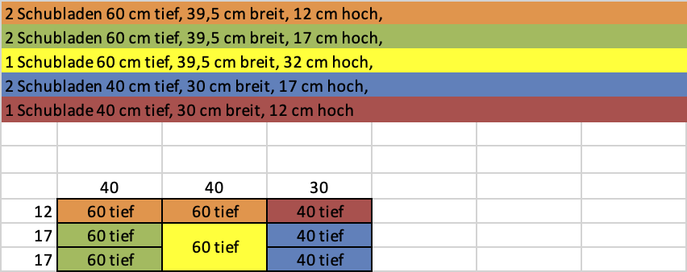
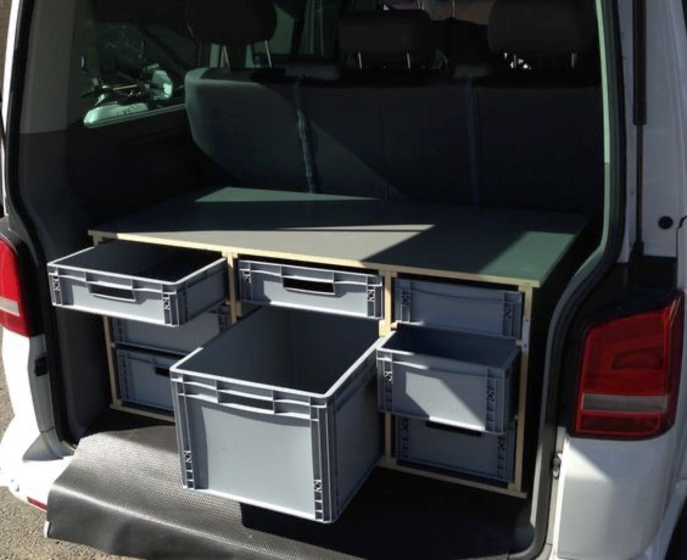

# Christians Staubox für seinen T5

Christian hat für seinen T5 eine tolle Staubox gebaut, und mir netterweise seine Daten geschickt.

## Technische Details

Von Christian zur Verfügung gestellt:

* Insgesamt 11 Boxen => Euro-Behältern von Auer
* Die Box ist 121cm breit, ca. 53cm hoch und ca. 60cm tief.

### Weitere QA & Gedanken

* Wieso hast Du denn die rechten Boxen weniger tief gemacht? Ist das Schränkchen auf der rechten Seite auch weniger tief?
Die Kiste ist symmetrisch, aber die schmalen Boxen gibts nur in 40cm Tiefe. Ich hab in der Kiste rechts innen deshalb Anschläge eingebaut, damit die kürzeren Boxen nicht nach hinten rutschen. Hier zu bestellen:
https://www.auer-packaging.com/de/de/Eurobehälter-geschlossen.html
Offen/geschlossen bei den Artikeln bedeutet übrigens: seitliches Eingriffsloch ja/nein
* Was für Holz hast Du denn benutzt? 
Das ist 12mm wasserfest beschichtetes Multiplex (ich glaube Birke). Zuschnitt beim Rettenberger Werkmarkt in Ottobrunn. Die haben auch die schmalen Führungsleisten zugeschnitten, die ich eingeklebt und geschraubt habe. Stirnseite der Leisten habe ich jeweils etwas abgerundet, damit die Schubladen beim Einsetzen nicht hängen bleiben.
* Die Staubox ist so tief wie das Flexboard. D.h., dass die Rückbank umgelegt werden kann, und man dann eine ebene Schlaffläche hat.
* Wenn man die unteren Kisten rausnimmt, hätte man Lücken um Skier durchzuschieben. Wahrscheinlich würde man rechts und links unten die Schubladen auslassen - bei sehr vielen Skiern auch die mittlere, große Kiste.
* Die Staubox ist nicht am Bus verschraubt, sondern steht auf einer rutschfesten Gummitmatte. Da sie (normalerweise) vorne an der Sitzbank ansteht ist sie auch bremssicher verkeilt. 

